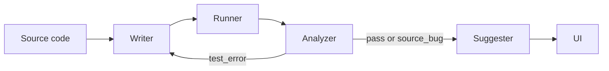

# TestForge

Aimed at the part of the day where you have just finished a Python
function and want a pytest suite for it without writing one by hand
and without sending the source off to a paid API. Runs entirely
against local Ollama models.

# Use Case
- Reduce QA workload in early-stage startups
- Automatically detect logic bugs before production

## How it works



Each box is a LangGraph node.

The **writer** generates pytest tests for the user's code. The first
iteration sees only the source; later iterations also receive the
previous pytest output and the analyzer's diagnosis, so the model can
correct itself instead of re-emitting the same broken test.

The **runner** writes the source to `sandbox/source_code.py`, runs
pytest with `--cov`, and parses the output. Tests with no assertions
are rejected before pytest is ever spawned, and the source is compiled
once before the subprocess starts so syntax errors fail fast.

The **analyzer** classifies failures as `TEST_ERROR` (bad test) or
`SOURCE_BUG` (the user's code violates its spec). When the verdict is
`SOURCE_BUG` the loop stops — retrying will not fix code that is the
problem. Otherwise the analyzer's notes go back to the writer for
another attempt, up to three iterations.

The **suggester** runs once at the end and produces a structured list
of crash and logic bugs with concrete fix hints. Few-shot examples are
injected into the prompt to keep the output JSON-shaped.

## Installation

Install Ollama and pull the three models used by default:

```
ollama pull qwen2.5-coder:7b
ollama pull qwen3:8b
ollama pull llama3.1
```

Then create a Python environment and install the requirements:

```
conda create -n autotest python=3.11
conda activate autotest
pip install -r requirements.txt
```

## Usage

Start the Streamlit UI:

```
streamlit run app.py
```

Pick a source type (function or API) in the sidebar, paste your code,
and click *Run*. The sidebar also exposes the iteration cap and the
coverage threshold. Each run writes its full transcript — generated
tests, pytest output, analyzer notes, suggestions, history — to
`runs/<run_id>_<source_type>/`.

## Configuration

The agents read their model name from the environment. Defaults are
shown in parentheses.

| Variable                   | Default                    |
| -------------------------- | -------------------------- |
| `AUTOTEST_WRITER_MODEL`    | `qwen2.5-coder:7b`         |
| `AUTOTEST_ANALYZER_MODEL`  | `qwen3:8b`                 |
| `AUTOTEST_SUGGESTER_MODEL` | `qwen3:8b`                 |
| `AUTOTEST_MODEL`           | `llama3.1` (fallback)      |
| `AUTOTEST_LLM_TIMEOUT`     | `180` (seconds, per-read)  |
| `OLLAMA_HOST`              | `http://localhost:11434`   |
| `AUTOTEST_USE_DOCKER`      | unset (subprocess sandbox) |
| `AUTOTEST_DOCKER_IMAGE`    | `autotest-sandbox`         |

If `OLLAMA_HOST` is set without a scheme it is prefixed with `http://`
automatically.

### Sandboxing

By default the runner shells out to `pytest` directly on the host.
That is fast but assumes the code under test is your own — it has the
same access to the filesystem and the network as the user running
Streamlit. Set `AUTOTEST_USE_DOCKER=1` and the runner will instead run
each pytest invocation in an ephemeral container built from
`Dockerfile.sandbox`, with no network (`--network none`) and a
512 MB / 2 CPU cap. Only `sandbox/` is bind-mounted in, so the rest of
the host filesystem is not visible. The image is built on the first
run if it is not already present (about a minute) and then reused.

### A note on VRAM

The default writer (`qwen2.5-coder:7b`, around 4.7 GB) and the default
analyzer/suggester (`qwen3:8b`, around 5.6 GB) do not fit together in
6 GB of VRAM. To avoid Ollama's eviction-and-partial-offload cycle the
loader explicitly evicts the previous model whenever a different model
is requested next. Same-model calls — for example analyzer to
suggester — are left alone and stay resident, so the only reload cost
paid is the one that is actually needed.

## Project layout

```
app.py                  Streamlit UI
graph.py                LangGraph wiring of the four agents
agents/
    __init__.py         model defaults and the LLM cache
    context.py          TestContext — the per-run state object
    writer.py           pytest test generator
    runner.py           sandbox + pytest runner
    analyzer.py         failure / coverage analysis
    suggester.py        bug list + fix suggestions
    prompts/            few-shot examples for the suggester
benchmarks/
    cases/              fifteen labelled cases (clean / crash / logic)
    results/            per-run reports
scripts/
    run_benchmark.py    CLI runner for the benchmark suite
sandbox/                where the runner places code under test
runs/                   per-run artifact dumps
```

## Known limitations

The default subprocess runner is fine for your own code but does not
isolate untrusted input — set `AUTOTEST_USE_DOCKER=1` for that. The
suggester sometimes emits prose instead of JSON and the fallback
parser papers over more than it should, which inflates false
positives on clean code. The writer occasionally skips edge-case
tests when the source does not visibly handle them, so a single
iteration can miss a genuine crash bug. Both of these are next on the
list.

## License

TBD.
